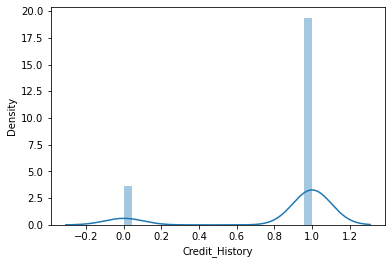
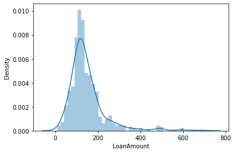
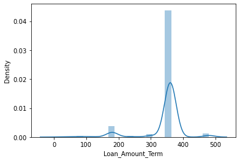
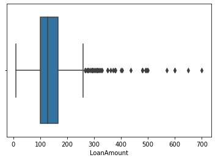
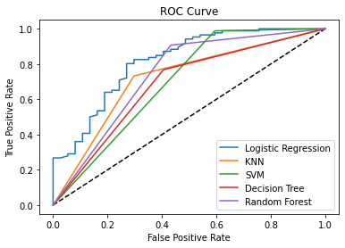

# Loan-Approval-Prediction

## Project Overview
This project to determine the loan approval based on personal information and loan history that has been done.
Performing comprehensive EDA on Loan Approval Prediction dataset to understand important variables, handled missing values,
outliers, and ensembled machine learning models to predict applicant's loan approval. The 
best model to this project is random forest with ROC/AUC evaluation matrix.

  
I will predict whether the loan can be approved or not and compare it to the actual status of the loan.

## Data Overview
The data retrieved from Kaggle dataset. The data consist of 614row x 13col

| Variables          | Description                                  |
|--------------------|----------------------------------------------|
| Loan ID            | Unique Loan ID number                        |
| Gender             | Customer's Gender                            |
| Married            | Applicant's Marital Status                   |
| Dependents         | Number of Applicant Dependents               |
| Education          | Applicant Education (Graduate/Undergraduate) |
| Self Employed      | Whether Applicant Self-employed              |
| Applicant Income   | Applicant Income                             |
| Coapplicant Income | Coapplicant Income                           |
| Loan Amount        | Loan Amount (in thousands)                   |
| Loan Amount Term   | Term of Loan (in months)                     |
| Credit History     | Credit History Meets Guidelines              |
| Property Area      | Urban / Semi urban / Rural                   |
| Loan Status        | Loan Approved (Y/N)                          |

## Framework Steps
1. Data Preparation
2. Data Cleaning
3. EDA
4. Feature Engineering & Feature Scaling
5. Modeling
6. Evaluation

## Result
Using 5 models, this are the results of the evaluation of the matrix:

| Model               | Precision | Recall | F1-Score | Accuracy | ROC/AUC |
|---------------------|-----------|--------|----------|----------|---------|
| Logistic Regression | 0.81      | 0.94   | 0.87     | 0.80     | 0.82    |
| KNN                 | 0.85      | 0.73   | 0.79     | 0.72     | 0.72    |
| SVM                 | 0.79      | 0.99   | 0.88     | 0.81     | 0.70    |
| Decision Tree       | 0.81      | 0.77   | 0.79     | 0.72     | 0.68    |
| Random Forest       | 0.83      | 0.91   | 0.87     | 0.80     | 0.74    |

